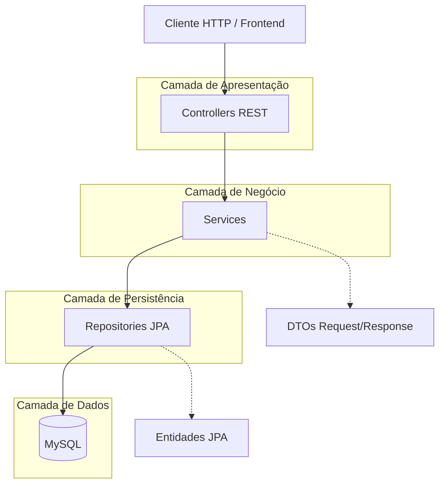
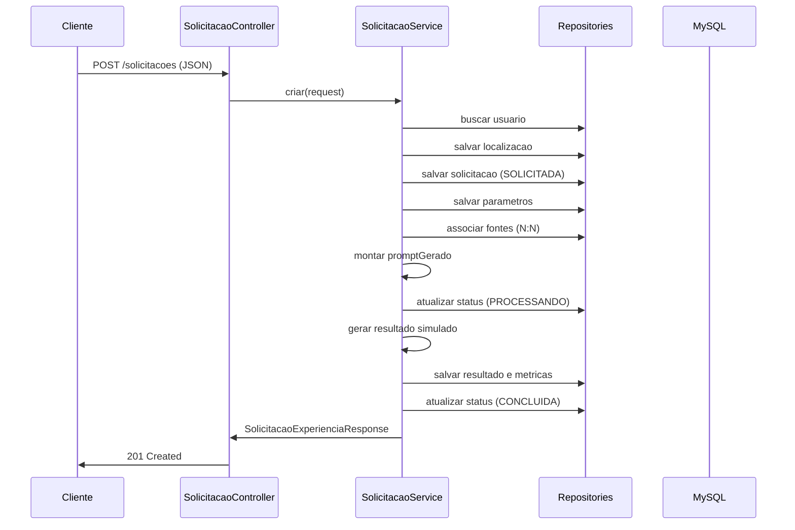

# Arquitetura do Backend — Global Solution

Documento de referência para o relatório técnico do projeto. Descreve a organização do backend, as responsabilidades de cada camada, os fluxos principais e as decisões de projeto adotadas.

---

## 1. Contexto e objetivo

O **Global Solution** é uma plataforma de experiências imersivas **sob demanda**. O usuário informa uma localização, escolhe uma categoria (clima, história, futuro, espaço, urbano ou livre), descreve o que deseja visualizar e pode incluir parâmetros flexíveis. O backend registra essa solicitação, simula um processamento e devolve um resultado conceitual com métricas.

Este documento explica **como o backend foi estruturado** para suportar esse fluxo de forma organizada, testável e alinhada a boas práticas de desenvolvimento orientado a objetos.

**Escopo do protótipo:** IA generativa, satélites, mapas em tempo real e modelos 3D **não são integrados de fato**. Prompts, resultados e métricas são gerados por regras internas do sistema e persistidos no banco MySQL.

---

## 2. Stack tecnológica

| Tecnologia | Papel no projeto |
|------------|------------------|
| Java 17 | Linguagem base |
| Spring Boot 3.4 | Framework de aplicação |
| Spring Web | Exposição REST (JSON) |
| Spring Data JPA | Persistência orientada a objetos |
| Hibernate | ORM e mapeamento entidade ↔ tabela |
| Bean Validation | Validação de DTOs de entrada |
| MySQL 8 | Banco relacional (`global_solution`) |
| Maven Wrapper | Build e execução padronizados |

Pacote raiz: `br.com.globalsolution`

---

## 3. Estilo arquitetural

O backend adota **arquitetura em camadas (layered architecture)**. Cada camada tem uma responsabilidade definida e se comunica preferencialmente com a camada imediatamente abaixo.



### Princípios adotados

1. **Separação de responsabilidades** — HTTP, regra de negócio e acesso a dados ficam em pacotes distintos.
2. **Controllers finos** — recebem requisição, validam formato e delegam ao service.
3. **Services como núcleo** — concentram regras, orquestração e simulação.
4. **DTOs na fronteira da API** — entidades JPA não são expostas diretamente nos endpoints.
5. **Inversão de dependência** — controllers e services dependem de interfaces repository, não de SQL manual.

---

## 4. Estrutura de pacotes

```
br.com.globalsolution
├── GlobalSolutionApplication.java    # Classe principal Spring Boot
├── controller/                       # Endpoints REST (5 controllers)
├── service/                          # Regras de negócio (5 services)
├── repository/                       # Acesso a dados JPA (8 repositories)
├── model/                            # Entidades JPA
│   └── enums/                        # Enumerações de domínio
├── dto/
│   ├── request/                      # Objetos de entrada da API
│   └── response/                     # Objetos de saída da API
└── exception/                        # Exceções e tratamento global
```

---

## 5. Camadas e responsabilidades

### 5.1 Controller (Apresentação)

**Responsabilidade:** receber requisições HTTP, acionar o service correto e devolver respostas com status adequado.

| Controller | Base path | Função principal |
|------------|-----------|------------------|
| `UsuarioController` | `/usuarios` | Cadastro e consulta de usuários |
| `FonteDadosController` | `/fontes-dados` | Cadastro e listagem de fontes |
| `SolicitacaoExperienciaController` | `/solicitacoes` | Fluxo central de experiências |
| `AvaliacaoController` | `/avaliacoes` | Feedback do usuário |
| `EstatisticaController` | `/estatisticas` | Resumo agregado para análise |

**O que o controller faz:**
- Mapeia rotas com `@GetMapping`, `@PostMapping`, etc.
- Aplica `@Valid` nos bodies JSON.
- Retorna `ResponseEntity` com status `201` (criação) ou `200` (consulta).
- Habilita CORS com `@CrossOrigin(origins = "*")` para integração com frontend local.

**O que o controller não faz:**
- Validar email duplicado, calcular confiabilidade ou simular geração.
- Acessar repository ou entidade diretamente.

---

### 5.2 Service (Negócio)

**Responsabilidade:** implementar regras de negócio, coordenar persistência e montar respostas em DTO.

| Service | Responsabilidade resumida |
|---------|---------------------------|
| `UsuarioService` | Criar usuário, validar email único, nunca expor senha |
| `FonteDadosService` | CRUD de fontes, confiabilidade padrão 70.0 |
| `SolicitacaoExperienciaService` | Fluxo completo de solicitação e simulação |
| `AvaliacaoService` | Registrar nota (1–5) vinculada a usuário e solicitação |
| `EstatisticaService` | Totais, médias e agrupamento por categoria |

**Padrões utilizados:**
- `@Service` para registro no contexto Spring.
- `@Transactional` em métodos de escrita.
- `@Transactional(readOnly = true)` em consultas (evita problemas de lazy loading ao montar DTOs).
- Mapeamento entity → DTO em métodos privados (sem MapStruct nesta versão).

O **`SolicitacaoExperienciaService`** é o componente central do sistema. Ele concentra o fluxo que simula a “geração imersiva”.

---

### 5.3 Repository (Persistência)

**Responsabilidade:** abstrair operações CRUD e consultas no banco via Spring Data JPA.

Exemplos de interfaces:

| Repository | Métodos derivados relevantes |
|------------|------------------------------|
| `UsuarioRepository` | `findByEmail`, `existsByEmail` |
| `SolicitacaoExperienciaRepository` | `findByUsuarioId`, `findByCategoriaExperiencia`, `findByStatus`, `countByStatus` |
| `ParametroSolicitacaoRepository` | `findBySolicitacaoId` |
| `ResultadoGeracaoRepository` | `findBySolicitacaoId` |
| `AvaliacaoRepository` | `findBySolicitacaoId`, `findByUsuarioId` |

Os repositories estendem `JpaRepository<Entidade, Long>` e não contêm lógica de negócio.

---

### 5.4 Model (Domínio persistido)

**Responsabilidade:** representar tabelas e relacionamentos do banco com anotações JPA.

Entidades principais:

| Entidade | Papel |
|----------|-------|
| `Usuario` | Identifica quem solicita e avalia experiências |
| `Localizacao` | Ponto ou região geográfica da experiência |
| `SolicitacaoExperiencia` | Pedido central — nasce da interação do usuário |
| `ParametroSolicitacao` | Par chave/valor flexível por solicitação |
| `FonteDados` | Referência conceitual de dados (satélite, mapa, etc.) |
| `ResultadoGeracao` | Saída simulada (1:1 com solicitação) |
| `MetricaResultado` | Indicadores numéricos do resultado |
| `Avaliacao` | Nota e comentário do usuário |

Enums em `model.enums`: `CategoriaExperiencia`, `TipoTemporal`, `NivelDetalhamento`, `StatusGeracao`, `TipoParametro`, `TipoFonteDados`.

As entidades usam Bean Validation (`@NotBlank`, `@Email`, `@DecimalMin`, etc.) para garantir integridade antes da persistência.

---

### 5.5 DTO (Contrato da API)

**Responsabilidade:** definir o formato JSON de entrada e saída, independente das entidades.

**Request (exemplos):** `CriarUsuarioRequest`, `CriarSolicitacaoExperienciaRequest`, `CriarAvaliacaoRequest`

**Response (exemplos):** `UsuarioResponse`, `SolicitacaoExperienciaResponse`, `EstatisticaResponse`

**Motivação:**
- Evitar expor senha e detalhes internos.
- Permitir estruturas aninhadas na API (ex.: localização dentro da solicitação) sem forçar o mesmo desenho nas entidades.
- Validar entrada na borda da aplicação com `@Valid`.

---

## 6. Fluxo principal de negócio

Criação de uma solicitação de experiência (`POST /solicitacoes`):



### Etapas do `SolicitacaoExperienciaService.criar()`

1. Validar existência do usuário.
2. Criar e persistir `Localizacao`.
3. Criar `SolicitacaoExperiencia` com status `SOLICITADA`.
4. Persistir lista de `ParametroSolicitacao`.
5. Associar `FonteDados` informadas (opcional).
6. Montar `promptGerado` (texto técnico interno).
7. Alterar status para `PROCESSANDO`.
8. Gerar `ResultadoGeracao` conforme a categoria.
9. Criar `MetricaResultado` simuladas por categoria.
10. Finalizar com status `CONCLUIDA` e `dataProcessamento`.
11. Retornar DTO completo (solicitação + parâmetros + fontes + resultado + métricas).

---

## 7. Conceitos de orientação a objetos aplicados

| Conceito | Aplicação no projeto |
|----------|----------------------|
| **Encapsulamento** | Campos privados em entidades e DTOs; acesso via getters/setters |
| **Abstração** | Services expõem operações de negócio; repositories escondem SQL |
| **Separação de concerns** | Controller ≠ Service ≠ Repository |
| **Composição** | Solicitação compõe localização, parâmetros, fontes e resultado |
| **Enumerações** | Categorias, status e tipos modelados como enums type-safe |
| **Polimorfismo (conceitual)** | Resultado e métricas variam conforme `CategoriaExperiencia` (switch no service) |
| **Inversão de dependência** | Injeção via construtor; Spring gerencia ciclo de vida |

---

## 8. Decisões de modelagem relevantes

### 8.1 Experiências sob demanda (sem catálogo)

Não existe tabela de “experiências prontas” nem catálogo fixo. Toda experiência nasce de uma **solicitação** criada pelo usuário com título, descrição, categoria e parâmetros próprios. Isso reflete o requisito de personalização e evita manutenção de conteúdo pré-cadastrado.

### 8.2 Temporalidade sem tabela de períodos

Em vez de cadastrar períodos históricos no banco, o sistema usa:

- `TipoTemporal` (PASSADO, PRESENTE, FUTURO, HIPOTETICO)
- `anoReferencia` opcional na solicitação

Assim, o usuário pode pedir “2000 anos atrás” ou “ano 2100” sem depender de registros prévios.

### 8.3 Parametros flexíveis

`ParametroSolicitacao` armazena `nome`, `valor` (String), `unidade` e `tipoParametro`. Exemplos reais do protótipo:

- `aumento_nivel_mar = 2 metros`
- `deslocamento_temporal = 200 anos_atras`

Novos cenários não exigem alteração de schema — apenas novos pares nome/valor.

### 8.4 Fontes de dados associáveis

Relacionamento **N:N** entre solicitação e fontes (`solicitacao_fontes_dados`). Fontes podem ser reutilizadas em várias solicitações. A confiabilidade média das fontes influencia o `indiceConfiabilidade` do resultado.

### 8.5 Métricas para análise

`MetricaResultado` guarda indicadores simulados (ex.: `nivel_risco`, `confiabilidade_historica`). Alimentam:

- resposta detalhada da solicitação;
- endpoint `GET /estatisticas` (médias e totais por categoria).

---

## 9. Regras de negócio principais

| Regra | Onde é aplicada |
|-------|-----------------|
| Email único por usuário | `UsuarioService` |
| Senha não retornada na API | `UsuarioService` → `UsuarioResponse` |
| `tipoUsuario` padrão `"USUARIO"` se vazio | `UsuarioService` |
| Confiança base padrão 70.0 em fontes | `FonteDadosService` |
| Solicitação só para usuário existente | `SolicitacaoExperienciaService` |
| Fonte inexistente → erro 404 | `SolicitacaoExperienciaService` |
| Status evolui SOLICITADA → PROCESSANDO → CONCLUIDA | `SolicitacaoExperienciaService` |
| Prompt montado a partir dos dados da solicitação | método privado no service |
| Resultado e métricas variam por categoria | métodos privados no service |
| Nota entre 1 e 5 | `AvaliacaoService` + Bean Validation |
| Estatísticas agregadas em memória | `EstatisticaService` |

---

## 10. Tratamento de erros

Classe `GlobalExceptionHandler` (`@RestControllerAdvice`) centraliza respostas no formato `ErroResponse`:

| Situação | HTTP | Exception |
|----------|------|-----------|
| Recurso não encontrado | 404 | `RecursoNaoEncontradoException` |
| Regra de negócio violada | 400 | `RegraNegocioException` |
| Validação de campo (@Valid) | 400 | `MethodArgumentNotValidException` |
| Erro não tratado | 500 | `Exception` |

Exemplo de resposta:

```json
{
  "timestamp": "2026-06-02T22:00:00",
  "status": 404,
  "mensagem": "Usuário não encontrado"
}
```

---

## 11. Persistência e transações

- **Banco:** MySQL, database `global_solution`.
- **DDL:** `spring.jpa.hibernate.ddl-auto=update` (Hibernate cria/atualiza tabelas em desenvolvimento).
- **Fetch lazy:** relacionamentos `@ManyToOne` e `@OneToOne` com `FetchType.LAZY`; consultas que montam DTOs completos rodam dentro de transação read-only.
- **Transações de escrita:** operações que criam solicitação, resultado e métricas em sequência usam uma única `@Transactional` no service.

Detalhes das tabelas e diagrama ER: ver [modelagem-banco.md](modelagem-banco.md).

---

## 12. Limitações do protótipo (escopo acadêmico)

Itens **fora do escopo** desta entrega:

- Autenticação e Spring Security
- Criptografia de senha (hash)
- Integração com IA generativa real
- APIs de satélite, mapas ou serviços 3D
- Frontend
- Filas assíncronas ou processamento em background

O protótipo demonstra **arquitetura em camadas**, **modelagem relacional**, **API REST funcional** e **simulação coerente** do fluxo de negócio.

---

## 13. Testes e demonstração

- Build: `.\mvnw.cmd clean install`
- Execução: `.\mvnw.cmd spring-boot:run` (porta **8081**)
- Testes manuais: arquivo `requests/global-solution.http`
- Fluxo validado ponta a ponta na Fase 7 do projeto

Roteiro sugerido para vídeo técnico: [roteiro-video-tecnico.md](roteiro-video-tecnico.md).

---

## 14. Referências internas

| Documento | Conteúdo |
|-----------|----------|
| [README.md](../README.md) | Execução rápida e lista de endpoints |
| [modelagem-banco.md](modelagem-banco.md) | Tabelas, relacionamentos e diagrama ER |
| [roteiro-video-tecnico.md](roteiro-video-tecnico.md) | Roteiro de apresentação em vídeo |
| [requests/global-solution.http](../requests/global-solution.http) | Payloads de teste da API |
