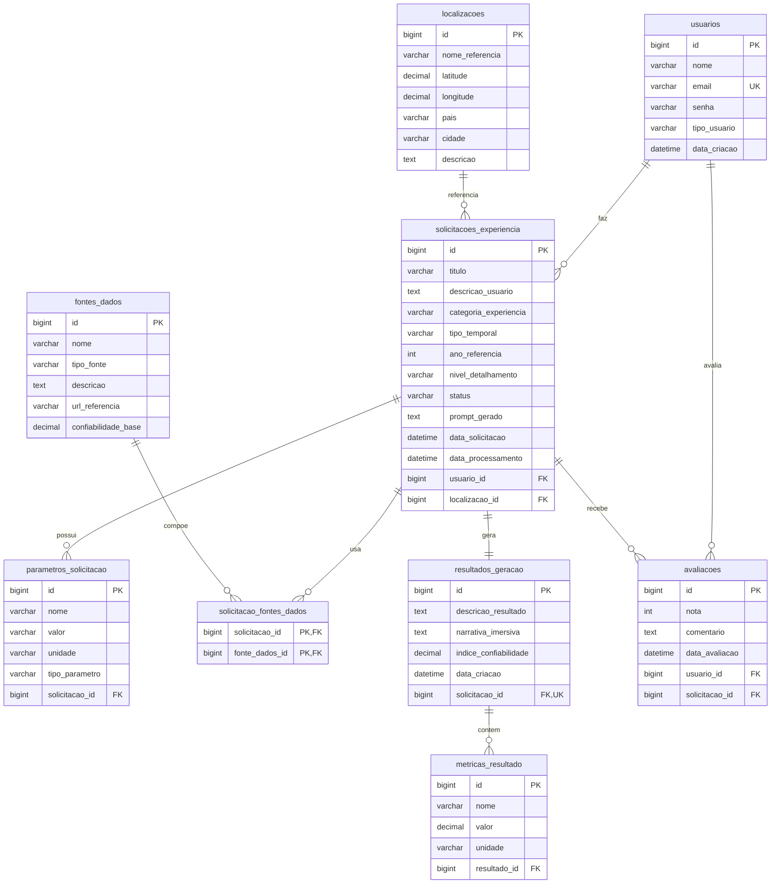

# DER do Banco de Dados — Global Solution

Documento de referência para o diagrama entidade-relacionamento do banco `global_solution`.

## Descrição da modelagem

O banco apoia uma plataforma de **experiências imersivas sob demanda**. A entidade central é `solicitacoes_experiencia`: cada registro representa um pedido feito pelo usuário, com localização, categoria, parâmetros flexíveis, fontes opcionais, resultado simulado e avaliações posteriores.

Não há catálogo fixo de experiências nem tabela de períodos temporais pré-cadastrados.

## Diagrama ER (Mermaid)

## Relacionamentos principais

| Relação | Cardinalidade | Descrição |
|---------|---------------|-----------|
| usuarios → solicitacoes_experiencia | 1:N | Um usuário pode fazer várias solicitações |
| localizacoes → solicitacoes_experiencia | 1:N | Uma localização pode ser reutilizada |
| solicitacoes_experiencia → parametros_solicitacao | 1:N | Parâmetros flexíveis por solicitação |
| solicitacoes_experiencia ↔ fontes_dados | N:N | Tabela `solicitacao_fontes_dados` |
| solicitacoes_experiencia → resultados_geracao | 1:1 | Um resultado por solicitação |
| resultados_geracao → metricas_resultado | 1:N | Indicadores do resultado |
| usuarios → avaliacoes | 1:N | Feedback do usuário |
| solicitacoes_experiencia → avaliacoes | 1:N | Avaliações por experiência gerada |

## Decisões de modelagem

### Sem tabela de períodos

A temporalidade é representada por `tipo_temporal` (PASSADO, PRESENTE, FUTURO, HIPOTETICO) e `ano_referencia` opcional na própria solicitação. Isso evita cadastro prévio de intervalos históricos e mantém o modelo flexível.

### Parametros flexíveis

A tabela `parametros_solicitacao` armazena pares nome/valor/unidade com tipo (TEXTO, NUMERICO, BOOLEANO, DATA). Cenários como “aumento de 2 metros do mar” ou “200 anos atrás” não exigem novas colunas na solicitação.

### Métricas para estatísticas

`metricas_resultado` guarda indicadores simulados (ex.: `nivel_risco`, `confiabilidade_historica`). Esses dados alimentam consultas analíticas e o endpoint `GET /estatisticas`.

## Scripts SQL

| Arquivo | Conteúdo |
|---------|----------|
| [schema.sql](sql/schema.sql) | Criação do banco e tabelas |
| [seed.sql](sql/seed.sql) | Dados de exemplo |
| [consultas-demonstracao.sql](sql/consultas-demonstracao.sql) | Consultas para demonstração |

A aplicação Java também persiste via JPA/Hibernate com `ddl-auto=update`. Os scripts servem como entregável documentado e podem ser executados manualmente no MySQL Workbench ou CLI.

## Documentação relacionada

- [modelagem-banco.md](modelagem-banco.md) — visão resumida das tabelas
- [arquitetura-backend.md](arquitetura-backend.md) — camadas e persistência
