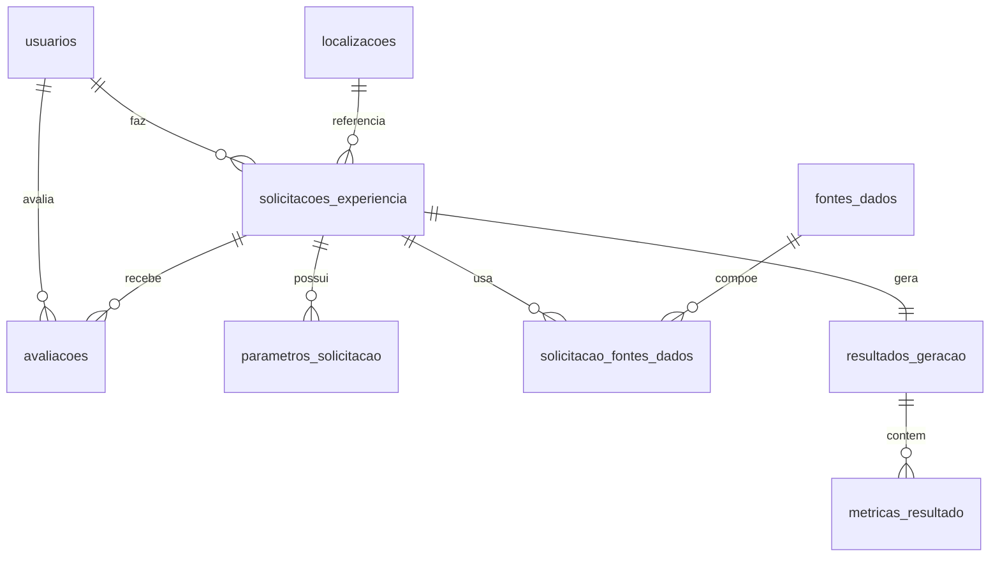

# Modelagem do banco de dados

Banco: **global_solution** (MySQL). Tabelas criadas/atualizadas via `spring.jpa.hibernate.ddl-auto=update`.

## Tabelas

| Tabela | Descrição |
|--------|-----------|
| `usuarios` | Usuários da plataforma |
| `localizacoes` | Pontos ou regiões geográficas |
| `solicitacoes_experiencia` | Pedidos de experiência imersiva (entidade central) |
| `parametros_solicitacao` | Parâmetros flexíveis de cada solicitação |
| `fontes_dados` | Fontes que podem alimentar a simulação |
| `solicitacao_fontes_dados` | Associação N:N entre solicitação e fontes |
| `resultados_geracao` | Resultado simulado (1:1 com solicitação) |
| `metricas_resultado` | Indicadores do resultado |
| `avaliacoes` | Notas e comentários dos usuários |

## Relacionamentos principais

- Um **usuário** pode ter várias **solicitações** e **avaliações**
- Uma **localização** pode ser reutilizada em várias solicitações
- Uma **solicitação** tem vários **parâmetros**, várias **fontes** (N:N), um **resultado** e várias **avaliações**
- Um **resultado** tem várias **métricas**

## Diagrama (Mermaid)

## Fluxo de dados

1. **Usuário** se cadastra
2. **Localização** é criada junto com a solicitação
3. **Solicitação** registra categoria, temporalidade, detalhamento e status
4. **Parâmetros** definem o cenário (ex.: metros de mar, anos no passado)
5. **Fontes** opcionais aumentam a confiabilidade simulada
6. **Resultado** armazena narrativa, descrição e índice de confiabilidade
7. **Métricas** complementam o resultado por categoria
8. **Avaliação** registra feedback do usuário
9. **Estatísticas** agregam totais, médias e contagem por categoria

## Enums relevantes

**CategoriaExperiencia:** CONSCIENTIZACAO_CLIMATICA, RECONSTRUCAO_HISTORICA, CENARIO_FUTURO, EVENTO_ESPACIAL, TRANSFORMACAO_URBANA, EXPERIENCIA_LIVRE

**StatusGeracao:** SOLICITADA → PROCESSANDO → CONCLUIDA (ou ERRO)

**TipoFonteDados:** SATELITE, MAPA, IMAGEM_HISTORICA, REGISTRO_GEOGRAFICO, BASE_CLIMATICA, DOCUMENTO, MODELO_IA, BASE_ASTRONOMICA

## Scripts SQL e DER

- Diagrama completo: [der-banco.md](der-banco.md)
- Criação das tabelas: [sql/schema.sql](sql/schema.sql)
- Dados de exemplo: [sql/seed.sql](sql/seed.sql)
- Consultas de demonstração: [sql/consultas-demonstracao.sql](sql/consultas-demonstracao.sql)
