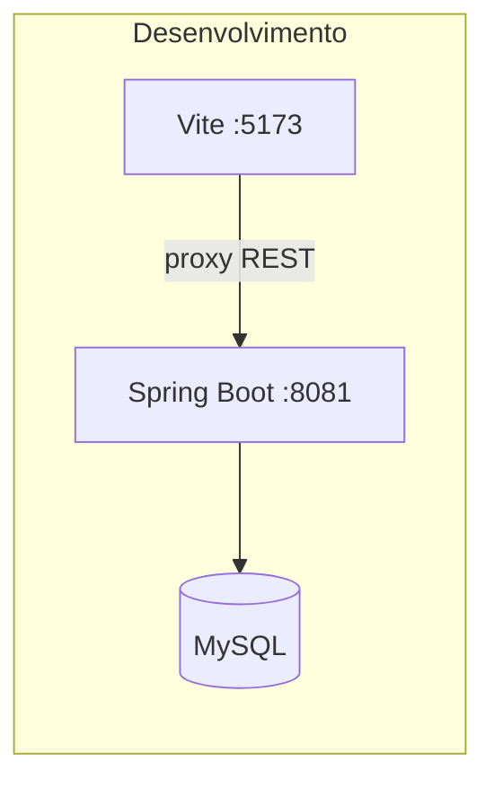

# Arquitetura do projeto MEMORA

## Visão geral

Monorepo inspirado no padrão ZUrbi: frontend e backend separados, documentação centralizada em `docs/`.

## Pastas

| Pasta | Tecnologia | Responsabilidade |
|-------|------------|------------------|
| `frontend/` | Vite, JS ES modules | UI MEMORA, build estático |
| `memora-backend/` | Spring Boot 3.4, JPA | API REST, persistência |
| `docs/` | Markdown, SQL | Modelagem, diagramas, roteiros |

## Fluxo de build

1. `frontend/npm run build` → `memora-backend/src/main/resources/static/`
2. `memora-backend/mvnw package` → JAR com UI + API
3. Deploy único na porta 8081

## Desenvolvimento local

- Frontend e backend em processos separados (hot reload no Vite).
- CORS habilitado para `localhost:5173` no backend.

## Integração API

Serviços em `frontend/src/services/` consomem endpoints documentados em `docs/arquitetura-backend.md` e `requests/global-solution.http`.
